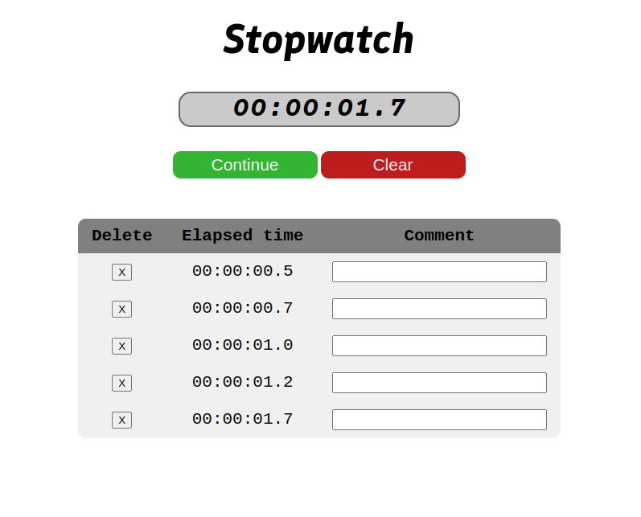

# Stopwatch app using vanilla Javascript
Demo image:

This project used [easytimer.js](https://albert-gonzalez.github.io/easytimer.js/) library to implement the Stopwatch's features like Start, Stop, Reset.